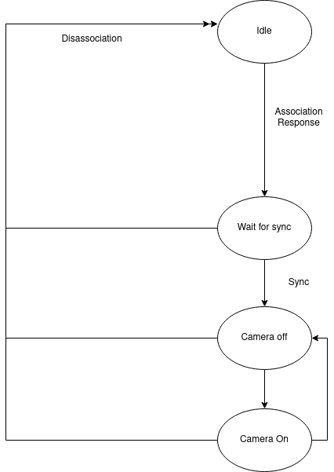
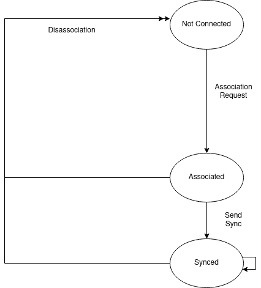

# Eyeotine Protocol (EP)

Version of this specification: **Draft-1.0**

## Header
- Version (2 bits, bitmask 0xc0) = 0
- Packet Type (2 bit, bitmask 0x30)/Subtype (4 bits, bitmask 0x0f)

## Packet Types

### Management (header=0x00)
#### Association (header=0x00)
- Flags (8 bit)
  - Req/Resp (1 bit, bitmask 0x01)
  - (unused) (7 bit)
#### Disassociation (header=0x01)
- (none)
#### Ping (header=0x02)
- (none)

### Control (header=0x10)
#### Restart (header=0x10)
- (none)
#### Sync (header=0x11)
- Flags (8 bit)
  - Req/Resp (1 bit, bitmask 0x01)
  - (unused) (7 bit)
#### Camera Settings (header=0x12)
- (variable)
#### Ota Installation request (header=0x13)
- (none)

### Data (header=0x20)
#### Image Data (header=0x20)
- Timestamp/Millisecs since Sync mod 1024 (10 bit, bitmask 0xffc0)
- Fragment Number (6 bit, bitmask 0x3f)
- (raw data) (0..2200 byte)

## Behavior Specification
### Client state machine
The client state machine shall be implemented as follows:  

#### General
In every, but the Idle state, the client shall return to Idle if
- a Disassociation Packet is received **or**
- the connection timeouts, ie. it receives no packets from the server for 5s

After at most 1s of inactivity, the client shall send a Ping Control Packet.

#### Idle
Idle describes the state in which the client is trying to connect to a server.

In this state, the client may send the following packet types:
- Association Request
All incoming packets except for a response should be discarded.

#### Wait for Sync
In Wait for Sync, the client waits for a Sync Control Packet.
This is required, since the obligatory timestamp field in the Image Data Packet could otherwise not be filled correctly.

In this state, the client may send the following packet types:
- Management
- Control
In this state, the client may receive the following packet types:
- Management
- Control

#### Camera Off
This state represents the initial connected and synced state, where the connection is fully available.

In this state, the client may send the following packet types:
- Management
- Control
- Data
In this state, the client may receive the following packet types:
- Management
- Control

#### Camera On
This state represents a connected and synced state, where the connection is fully available.
When the camera is turned on, the client shall regularly send camera images using Camera Data frames.

In this state, the client may send the following packet types:
- Management
- Control
- Data
In this state, the client may receive the following packet types:
- Management
- Control

### Server state machine
The server state machine *for each connection* should be implemented as illustrated:  

#### General
In every, but the Not Connected state, the server shall return to Not Connected if
- a Disassociation Packet is received **or**
- the connection timeouts, ie. it receives no packets from the client for 5s

After at most 1s of inactivity, the server shall send a Ping Control Packet.

#### Not Connected
In this state, the server awaits an incoming connection from the client and reply to it with an association response.

In this state, the server may receive the following packet types:
- Association Request
In this state, the server may not send any packets.

#### Associated
After association, the server shall resynchronize all clients.

In this state, the server may receive the following packet types:
- Management
- Control
In this state, the server may send the following packet types:
- Management
- Control

#### Synced
In this state, all features of the connection are available.

In this state, the server may receive the following packet types:
- Management
- Control
- Data
In this state, the server may send the following packet types:
- Management
- Control
